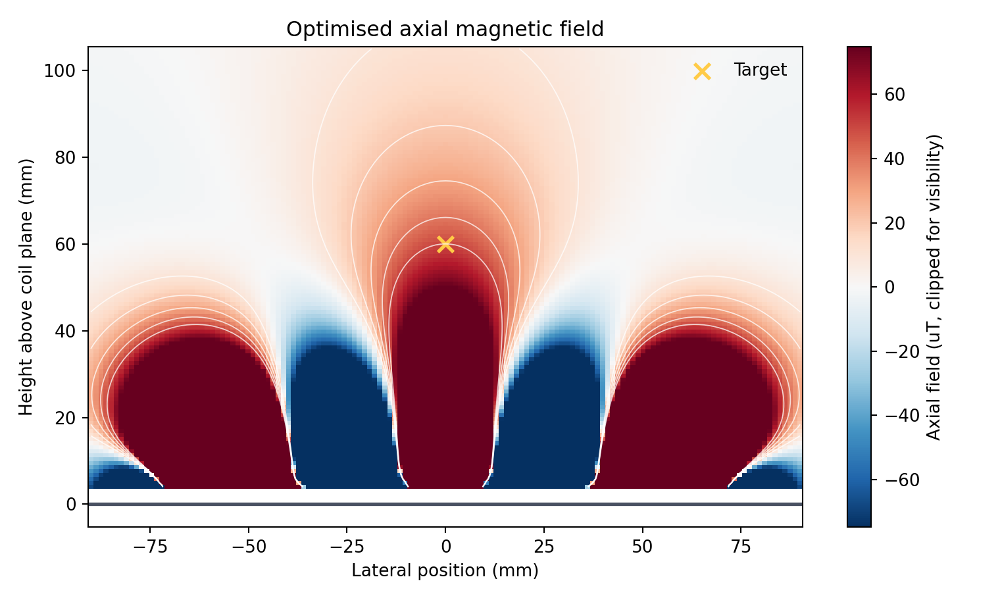
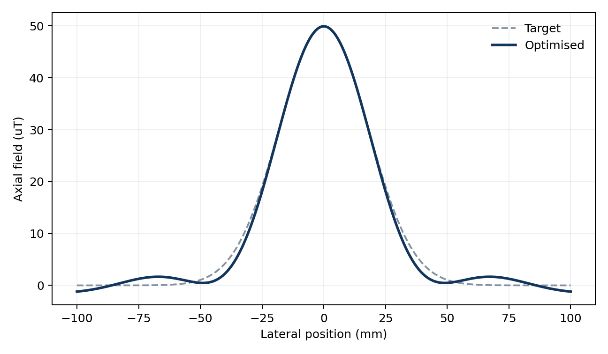
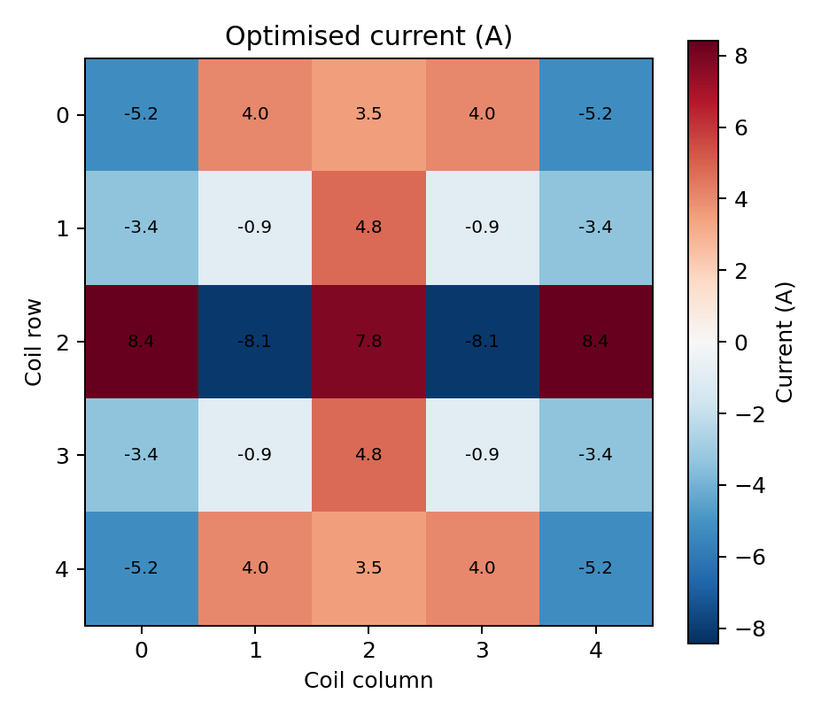
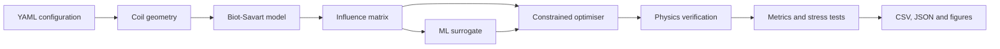
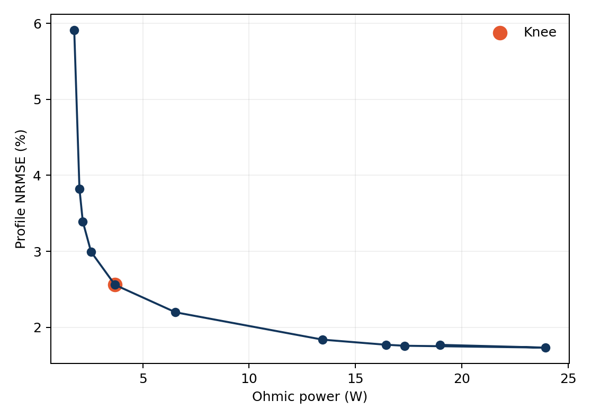
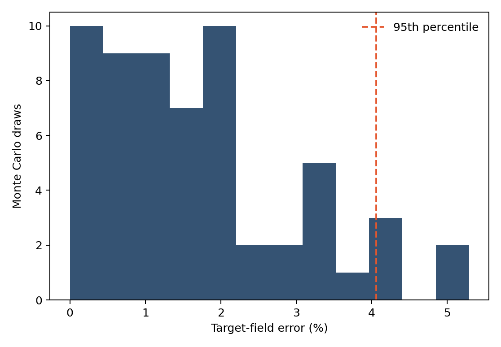

# Physics-Constrained Magnetic Field Optimisation

### Inverse-designing spatial magnetic fields with validated physics, constrained optimisation, robustness analysis, and solver-verified machine learning

[](https://github.com/Ali-Mattar-code/magnetic-field-optimisation/actions/workflows/ci.yml)
[](https://www.python.org/)
[](tests/)
[](LICENSE)

This project solves a deceptively difficult engineering problem: **how should an array of individually controlled coils be driven to create a strong, localised magnetic field while limiting leakage, current, and heat?**

It turns that question into an auditable scientific-computing pipeline - from Biot-Savart simulation and inverse design to Monte Carlo stress testing and ML-assisted search.

<p align="center">
  
</p>

## Results at a glance

The committed quick-reproduction configuration currently produces:

| Result | Reproduced value | Why it matters |
|---|---:|---|
| Single-loop validation error | **0.022% max** | Numerical Biot-Savart model agrees with the analytical reference |
| Helmholtz-pair centre error | **0.014%** | Independent canonical geometry check |
| Requested target field | **50.0 uT** | Fixed-target inverse-design requirement |
| Achieved target field | **49.93 uT** | **0.144% target error** after forward verification |
| Full-profile NRMSE | **2.18%** | Optimisation controls the complete sampled profile, not only the centre point |
| Leakage beyond +/-40 mm | **4.57% of peak** | Fixed guard lies outside the designed main lobe |
| Ohmic power | **6.77 W** | Explicit copper-loss calculation, separate from inductive energy |
| Peak channel current | **8.42 A** | Within the configured 12 A driver limit |
| Robustness error | **4.06% at the 95th percentile** | 60 seeded perturbation trials across control and manufacturing errors |
| ML surrogate benchmark | **7.22% mean NRMSE** | Physics-informed 400-case study with 80 held-out cases; candidates remain solver-verifiable |

These are **simulation results**, not hardware measurements. Every value above is generated from committed code and configuration; assumptions are stored in [`results/reproduction_summary.json`](results/reproduction_summary.json).

<p align="center">
  
  
</p>

## What I built

- A vectorised 3-D Biot-Savart engine for arbitrarily positioned and oriented circular coils.
- A field influence matrix that converts an expensive geometry calculation into the linear map `B = A I`.
- A constrained quadratic optimiser balancing field fidelity, leakage suppression, Ohmic power, and per-channel current limits.
- Two interchangeable optimisation paths: SciPy by default and optional CVXPY.
- Physics validation against analytical single-loop and Helmholtz-pair solutions.
- Pareto-front generation and automatic knee selection instead of relying on one arbitrary regularisation value.
- Monte Carlo stress testing for current noise, resistance drift, position error, and angular misalignment.
- An exploratory multi-scale conductor basis and an Extra Trees surrogate using dimensionless geometry ratios and analytical field-scale features for faster screening.
- A command-line interface, interactive Streamlit demonstrator, automated tests, continuous integration, and machine-readable experiment artefacts.

## System architecture



The ML component accelerates candidate screening. It does not replace the physical model or certify its own outputs.

## The inverse-design formulation

For sampled observation points, linear superposition gives:

$$
\mathbf{B}=\mathbf{A}\mathbf{I}
$$

where `A` contains each coil's unit-current field and `I` is the current vector. The default solver minimises:

$$
\min_{\mathbf I}\;\left\|\mathbf W(\mathbf A\mathbf I-\mathbf b)\right\|_2^2
+\lambda\mathbf I^\mathsf{T}\mathbf R\mathbf I
$$

subject to a target-field tolerance and per-channel current limits.

Two electrical quantities are intentionally kept separate:

- **Steady-state heat loss:** `P_ohmic = I^T R I`
- **Stored magnetic energy:** `E_magnetic = 0.5 I^T L I`

Mutual inductance affects stored energy and transient behaviour; it is not counted as additional DC power loss.

## Quick start

```bash
git clone https://github.com/Ali-Mattar-code/magnetic-field-optimisation.git
cd magnetic-field-optimisation
python -m venv .venv
source .venv/bin/activate          # Windows: .venv\Scripts\activate
pip install -e ".[dev]"
magfield validate
magfield reproduce --config configs/quick_reproduction.yaml
pytest
```

Run the interactive design explorer:

```bash
pip install -e ".[app]"
streamlit run app/app.py
```

Use the optional CVXPY backend:

```bash
pip install -e ".[optimisation]"
magfield reproduce --config configs/baseline.yaml --backend cvxpy
```

## Reproducible outputs

| Artefact | Contents |
|---|---|
| [`reproduction_summary.json`](results/reproduction_summary.json) | Configuration, validation, field, electrical, solver, and robustness results |
| [`field_profile.csv`](results/field_profile.csv) | Target and realised axial-field samples |
| [`pareto_points.csv`](results/pareto_points.csv) | Power-error regularisation sweep |
| [`ml_benchmark.json`](results/ml_benchmark.json) | Exploratory local surrogate benchmark |
| [`freeform_comparison.json`](results/freeform_comparison.json) | Clearly labelled non-cost-equivalent conductor-basis preview |

<p align="center">
  
  
</p>

## Evidence and research integrity

This repository uses three explicit evidence levels:

1. **Reproduced here** - generated by committed code and configuration.
2. **Historical thesis result** - reported in the submitted dissertation but not claimed as reproduced by this clean-room repository.
3. **Exploratory** - a research direction or illustrative comparison requiring further validation.

My dissertation reported approximately **19% lower power**, **225x faster evaluations**, and **2.2x faster solves** in its original experiment set. Those values are preserved only as historical results in [`configs/thesis_historical.yaml`](configs/thesis_historical.yaml). They are never injected into the public reproduction output.

This distinction matters: a strong technical portfolio should make claims easier to audit, not merely larger.

## Repository structure

```text
magnetic-field-optimisation/
├── app/                  # Interactive Streamlit demonstrator
├── configs/              # Versioned physical and numerical assumptions
├── docs/                 # Methodology, architecture, provenance and limitations
├── experiments/          # Reproduction, free-form and ML studies
├── results/              # Committed JSON, CSV and figures
├── src/magfield/         # Reusable scientific Python package
├── tests/                # Physics, optimisation and interface tests
├── pyproject.toml        # Package, dependencies and developer tooling
└── README.md
```

## Design decisions worth reading

- [`docs/methodology.md`](docs/methodology.md) - forward model, inverse problem, metrics, robustness, and learning aid.
- [`docs/design-decisions.md`](docs/design-decisions.md) - explicit ampere-turns, physical energy accounting, PSD inductance matrices, and claim versioning.
- [`docs/provenance.md`](docs/provenance.md) - what came from the thesis and what was reconstructed publicly.
- [`docs/limitations.md`](docs/limitations.md) - what the simulation does not yet model.
- [`ROADMAP.md`](ROADMAP.md) - benchtop validation, thermal constraints, differentiable geometry, and robust control extensions.

## Research lineage

This is a **2026 clean-room public implementation** based on the specification and experiments from my UCL MSc Physics thesis. The underlying research was completed between **September 2024 and September 2025**. It is not presented as the original thesis source code.

**Author:** Ali Mattar  
**Research area:** scientific machine learning, constrained optimisation, electromagnetics, and inverse design

## Licence

Released under the [MIT License](LICENSE). Citation metadata is available in [`CITATION.cff`](CITATION.cff).
