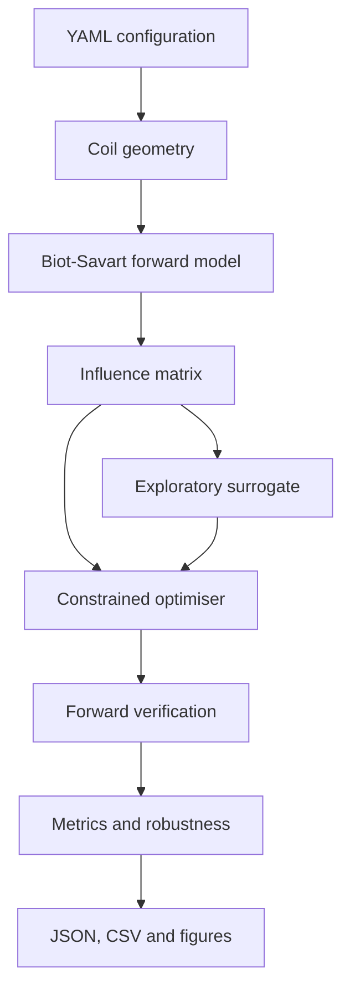

# Architecture

```mermaid
flowchart TD
    C["YAML configuration"] --> G["Coil geometry"]
    G --> F["Biot-Savart forward model"]
    F --> A["Influence matrix"]
    A --> O["Constrained optimiser"]
    O --> V["Forward verification"]
    V --> M["Metrics and robustness"]
    M --> R["JSON, CSV and figures"]
    A --> S["Exploratory surrogate"]
    S --> O
```

The package separates physics, electrical quantities, optimisation, evaluation, and reporting so that each assumption can be tested independently.

